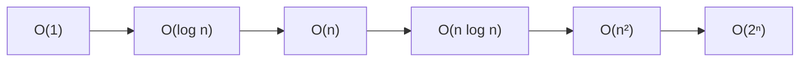

# Big-O Notation

Welcome! In this lesson we'll build up an intuition for **big-O notation** — the standard language for describing how an algorithm's running time grows with input size.

Suppose you time a function and find it takes $3n^2 + 20n + 100$ microseconds on an input of size $n$. That formula is precise, but it's cluttered: the constants depend on your laptop, the compiler, the weather. What we usually care about is the *shape* of the growth.

Big-O keeps just that shape. We say the running time is $O(n^2)$, meaning: for large $n$, it grows no faster than a constant multiple of $n^2$. The $20n$, the $100$, and even the leading $3$ all get absorbed.

```question
type: multiple-choice
prompt: A function's running time is $5n + n \log n + 42$. Which is the tightest big-O description?
choices:
  - text: '$O(n^2)$'
    explanation: This is a valid upper bound, but not the tightest one — the function grows more slowly than $n^2$.
  - text: '$O(n \log n)$'
    correct: true
    explanation: For large $n$, the $n \log n$ term dominates both $5n$ and $42$.
  - text: '$O(n)$'
    explanation: Too small — $n \log n$ eventually outgrows any constant multiple of $n$.
  - text: '$O(\log n)$'
    explanation: Much too small — even the $5n$ term outgrows this.
```

## Reading growth from code

The most common way to estimate big-O in practice is to count how many times the innermost work runs. Consider:

```python
def has_duplicate(items):
    for i in range(len(items)):
        for j in range(i + 1, len(items)):
            if items[i] == items[j]:
                return True
    return False
```

The comparison `items[i] == items[j]` runs at most $\binom{n}{2} = \frac{n(n-1)}{2}$ times, which is $O(n^2)$. Two nested loops over the input is the classic $n^2$ signature — though watch out, the *ranges* of the loops matter more than the loop count itself.

```question
type: free-response
prompt: |
  In the worst case, `has_duplicate` above is $O(n^2)$. But suppose the input list is **guaranteed to contain a duplicate within the first 10 elements**. What is the big-O running time now, and why?
criteria: >
  The answer should say the running time becomes O(1) (constant time), because the
  function returns as soon as it finds a duplicate, and a duplicate is guaranteed
  among the first 10 elements — so the work is bounded by a constant (at most ~45
  comparisons) regardless of n. Accept answers that clearly express constant-bounded
  work even if they don't write "O(1)" symbolically.
sample_answer: >
  It becomes O(1). The function returns early when it finds a duplicate, and since a
  duplicate must appear in the first 10 elements, it never does more than about
  10·9/2 = 45 comparisons, no matter how long the list is.
```

```question
type: exercise
id: faster-duplicates
prompt: |
  Time to make it fast for real. The exercise folder contains `duplicates.py` with the $O(n^2)$ implementation from above — rewrite `has_duplicate` to run in $O(n)$, then check your work with `python3 test_duplicates.py`.
folder: big-o-notation/faster-duplicates
context: >
  The intended solution is a single pass with a set of seen values (O(n) time,
  O(n) extra space). If they're stuck, first hint at "which data structure gives
  O(1) membership checks?" rather than giving the loop. The test file checks
  correctness and has a 2-second timing gate on 200k items that the quadratic
  version fails.
```

## Common growth classes

Here are the growth classes you'll meet most often, from slowest-growing to fastest:

| Class | Name | Typical example |
| --- | --- | --- |
| $O(1)$ | constant | hash table lookup |
| $O(\log n)$ | logarithmic | binary search |
| $O(n)$ | linear | scanning a list |
| $O(n \log n)$ | linearithmic | merge sort |
| $O(n^2)$ | quadratic | comparing all pairs |
| $O(2^n)$ | exponential | brute-force subsets |

Visually, the ladder looks like this — each arrow is a step up in cost:



The shapes tell the story at a glance — constant stays put, logarithmic flattens out, linear climbs steadily, and quadratic takes off:


A useful rule of thumb: each step down this table typically costs you somewhere between "noticeable" and "catastrophic" as inputs scale. An $O(n \log n)$ sort handles a billion items; an $O(n^2)$ one does not.

Numbers make it visceral — drag the slider and watch the operation counts spread apart:

```embed
src: big-o-notation/growth-race/index.html
height: 250
title: Operation counts by growth class, with an input-size slider
```

```question
type: multiple-choice
prompt: Binary search repeatedly halves the search interval until it finds the target. Why is it $O(\log n)$?
choices:
  - text: Because you can halve $n$ only about $\log_2 n$ times before reaching 1.
    correct: true
    explanation: Each comparison halves the remaining interval, so after $k$ steps the interval has size $n/2^k$ — it hits 1 when $k \approx \log_2 n$.
  - text: Because half of the array is never examined.
    explanation: More than half is skipped, in fact — but skipping work explains why it's fast, not why the count is specifically logarithmic.
  - text: Because logarithms grow slowly.
    explanation: True, but circular — this doesn't explain why the number of steps is logarithmic in the first place.
```

One subtlety worth remembering: big-O is an *upper bound on growth*, not a promise about actual speed. An $O(n)$ algorithm with a huge constant factor can lose to an $O(n^2)$ one for every input size you'll ever see in practice. Asymptotics tell you what wins *eventually*.

```question
type: open-ended
prompt: Think of a piece of software you use (or wrote) that got noticeably slower as its data grew — a chat app with years of history, a script over a growing folder, anything. Where do you suspect the super-linear work is hiding?
context: >
  Encourage them to connect the anecdote to a growth class. If they identify a
  plausible culprit (e.g. re-scanning everything on each update, an all-pairs
  comparison), name the likely class and mention the standard fix (indexing,
  caching, better data structure). Keep it light and curious.
```

That's the core of it: big-O compresses running-time formulas down to their growth shape, nested loops usually mean polynomial growth, halving means logarithms, and asymptotics describe the eventual winner — not necessarily today's.

🎓 You now know enough to read the "Complexity" line on any algorithm's documentation and know what it's telling you.
